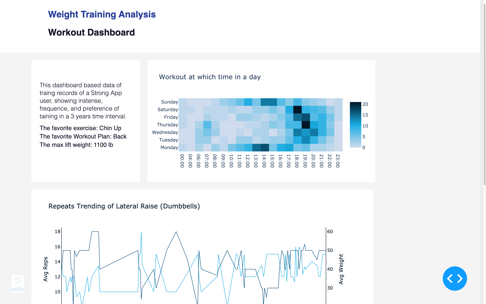

This project is a simple showcase of personal workouts data based on the Python dash library. The project contains there layers: MVC. In the model layer, sqlite is used for storing data, SQL is used for query and reshape the data to meet the graphs' needs. In the View and Controller layer, dash a python library build on top of the Flask and plotly.js is used for handle all the details.

This dashboard designed to show the profile of a personal workout plan. Answering questions like the traits of workouts, when the person like a workout in a day or week, time trend, etc.

**About the dataset**

The data comes from a dataset of [721 weight training records](https://www.kaggle.com/joep89/weightlifting) of one person use Strong App. The records period is from 2015 to 2018. Due to the nature of one personal data, the findings may not be generalized to others. But the dashboard can be used as a template for Strong App users to analyse their training performance.

The detailed variables introduction can be found through [the link to Kaggle](https://www.kaggle.com/joep89/weightlifting). The main variable of the dashboard includes the date, workout name, exercise name, reps, weight.

**Function and purpose**

As I said before, the data source is maybe weak at generalization, but is a good demo source for personal uses and demonstrate the interaction of date, exercises and training details.

Therefore, I extract the favorite exercise, the favorite workout plan, the heaviest set of the workout as three main concerns. Those indicators are calculated dynamically with the varying of datasets.

There are three graphs shows workout plans the frequency of three years in the day time and the week by a heatmap, time trend of workout reps and weight of each workout and overall exercises reps with a bar chart. The first chart in the right top indicates the workout time preferences in the day and weekday.

T**he interaction**

There is two kinds of interactions in the dashboard, hover and click. The hover can be found in all three charts.

The second and third charts have connections on the act of clicks. The second chart shows trends of a repeat of sets and weight with different line color. The third chart shows each exercises' average repeats ordering by ascending of repeats. When clicking on the point of the second chart, the third chart will show the exercise of that day. On the other hand, when clicking on the point of the third chart, the second chart will show the time trend of specific exercise.
  